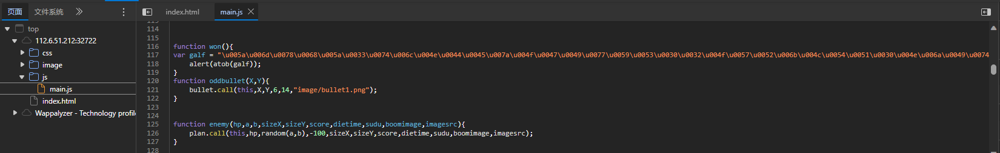
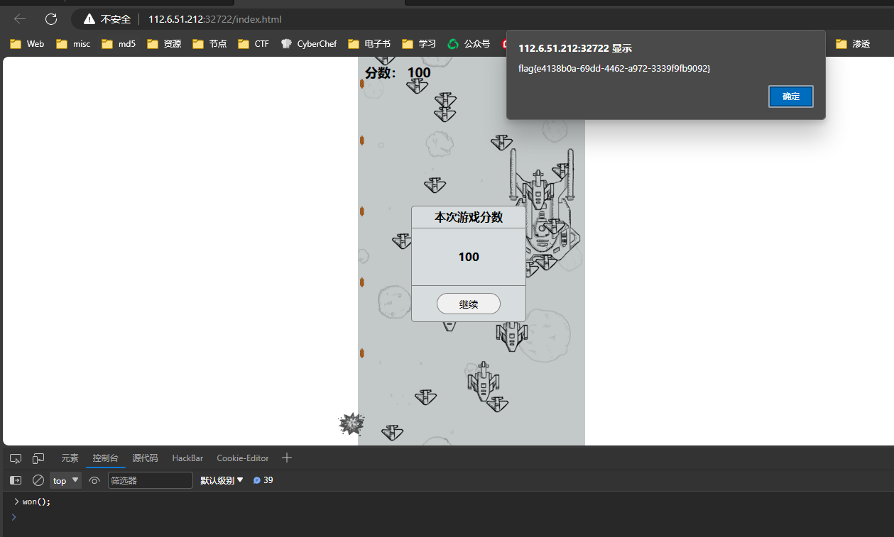
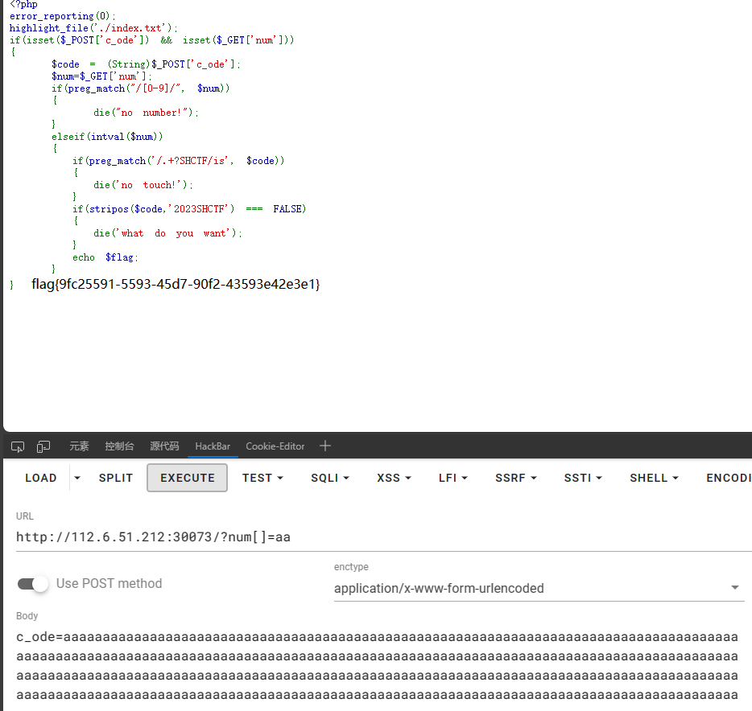
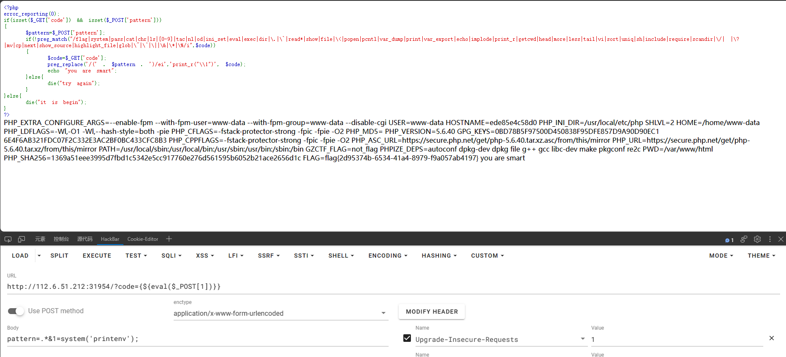

# Week1

> 完成题目32个，Misc 7/9、Crypto 12/15、Reserve 3/6、Pwn 2/9 、Web 7/7    <u>师傅们太强了，每天醒来排名掉10几</u>

## Web

#### 1、飞机大战





纯前端小游戏，无聊了可以玩到结束。拿flag就翻js代码，可以发现一串莫名的编码，在控制台调用这个函数即可，这类题目都是这样，翻代码。要是实在找不到，就下断点，在断点处改分数。

#### 2、登录就给flag

没什么说的，不考JWT，就是BP爆破

#### 3、生成你的邀请函吧~

更简单，调用API，生成海报，flag就在海报下面

#### 4、ez_serialize

考了几个php反序列化中常见的魔术方法的调用，不知道的请自行百度，网上太多了

具体解法是：通过反序列化调用B的wakeup，通过B的wakeup调用C的toString，通过C的toString 调用D的get，通过D的get调用A的invoke，最后执行文件包含

```php
$b=new B();
$b->q=new C();
$b->q->z=new D();
$b->q->z->p=new A();
$b->q->z->p->var_1='php://filter/convert.base64-encode/resource=flag.php';
echo serialize($b);
```


#### 5、babyRCE

过滤了很多能打印文本的命令，但是没有过滤cp和mv命令。因此可以直接用这个命令。

空格被过滤，可以使用${IFS}来绕过。因此，使用 `ls${IFS}/`查看根目录flag，然后使用`rce=cp${IFS}/fla?${IFS}ff.txt`来复制根目录下的flag，然后访问ff.txt即可

#### 6、1zzphp

第一步绕过，数组绕过正则，第二步，我实在没其他办法，就脏数据绕过，1002910个数据就已经可以绕过了



#### 7、ezphp

这里的过滤貌似有问题？就是个摆设，根本没过滤。



## Misc

#### 请对我使用社工吧

简单点的就是，通过题目知道k1sme4家附近的大学，那么直接在QQ群里找k1sme4的QQ号，然后社工库直接查，可以查到手机号还有地址，是山东东营的。接下来看图片，店铺后可以看到有"万达东"

那么在东营找万达，可以看到万达对面是中国石油大学。

#### ez-misc

拿到题目，一个压缩包，有一个加密文件，一串没加密的01，就想到01转图片，得到一个二维码图片，然后扫码，得到一串字符，发现是加密文件的密码，解码后可以看到是一个加密的flag压缩包，根据备注中的01转字符串，知道rockyou，那么就是密码爆破，得到flag文件。里面都是一堆字符。一眼词频统计，得到flag

#### 签到题

没什么说的，文件里的字符串，扔cyberchef里，直接出结果

#### Steganography

第一张图片的字符串里有base64编码，解密看到中间空了几个字符，第二张图片的exif信息里，可以看到空的几个字符，补全后解开压缩包，得到flag

#### 可爱的派蒙捏

一张小派蒙的照片，010打开看到里面有压缩包，提取出来后，看到两个txt，看大小知道txt2比1大2字节，对比两个文本，发现有几行都会多出来1个字符，连起来就知道，这是flag了

#### message

下载附件，看到是一堆16进制，用010导入，就看到了flag。真就签到。。

####  真的签到

扫描，关注公众号，回复。经典签到题

>  剩下两个，都是解出了一半，然后get不到出题人的思路了。做Misc真的很需要和出题人脑电波同步

## Crypto

#### 立正

刚开始没注意，用ciphey解了，然后就掉坑里了

其实很简单，先逆转字符串，然后，用caser就发现，他是一句话，Q Look at you ...........

别问我为啥是Q，我最开始也以为是I，害得我一度怀疑是哪里有问题

正题：逆转后，根据语义，计算出小写字母，大写字母，数字的偏移量，然后对应偏移就行，要记住的是"flag{"的base64编码。不然你也猜不到数字的偏移量

然后得到的字符串base64 解码就ok了。

> 这个题细节很重要，没做出来的人大概率没发现最开始的那点。虽然给了提示："正"，但是对我来说就是有思路了才想到这个提示的意思

```python
enc="wl hgrfhg 4gNUx4NgQgEUb4NC64NHxZLg636V6CDBiDNUHw8HkapH :jdoi vl vlkw  ~xrb wd nrrT Y:"
enc=enc[::-1]
dict='abcdefghijklmnopqrstuvwxyz'
upper='ABCDEFGHIJKLMNOPQRSTUVWXYZ'
num='0123456789'
flag=''
for i in enc:
    if ord(i) in range(97,123):
        flag+=chr((ord(i)-ord('a')-3)%26+ord('a'))
    elif ord(i) in range(65,91):
        flag+=chr((ord(i)-ord('A')-8)%26+ord('A'))
    elif ord(i) in range(48,58):
        flag+=chr((ord(i)-ord('0')-5)%10+ord('0'))
    else:
        flag+=i
print(flag)
```


#### Crypto_Checkin

拿到后扔cyberchef里，发现出不来，那么就用另一个神器：ciphey，具体安装请见百度。ciphey -t ""

就得到了flag

│    base85                                      │
│    utf8                                       	 │
│    base64                                      │
│    utf8                                       	 │
│    base32                                      │
│    utf8                                        	│
│    base16                                      │
│    utf8Plaintext: "flag{Th1s_1s_B4s3_3nc0d3}"


#### 残缺的md5

没啥说的，就是爆破

```python
from hashlib import md5
dec='F0AF????B1F463????F7AE???B2AC4E6'
key='f0af'
enc='KCLWG{1}K8M9O3{2}DE{3}84S9'
dic='ABCDEFGHIJKLMNOPQRSTUVWXYZ'
for i in dic:
    for j in dic:
        for k in dic:
            str=enc.replace('{1}',i).replace('{2}',j).replace('{3}',k)
            #打印md5的前3位置
            if md5(str.encode('utf-8')).hexdigest()[0:4]==key:
                print(str)
                print(md5(str.encode('utf-8')).hexdigest())

```

#### 凯撒大帝

简单的做法，扔ciphey一跑就出来。

#### 进制

没什么区别，古典密码的差不多都这样，像这些套娃的，要认真识别特征，猜测编码，不如用现有工具直接出。当然，做的多了，认得也多了

#### 迷雾重重

根据题目，看看字符串，就应该想到把01替换成".-"。然后morse解码就ok

#### 难言的遗憾

根据题目，清政府拒不采纳那份编码规则，百度知道中文电报，自行找到编码表，然后对照就行

#### 小兔子可爱捏

根据题目就知道是rabbit加密，然后百度出密钥，解密就ok

#### what is m

没啥说的了。。。。long_to_bytes

#### really_ez_rsa

就是普普通通的经典rsa题目，甚至不需要分解n，n=p*q，解密就行。

#### okk

答案很清晰明了


> Crypto的古典密码没什么好写wp的，要不工具一把梭，要不见的多了，一眼认出是什么，认不出的，要么一个一个试，要不放弃了。正如另外三道，都是解一半，后面的解不出来了，确实是我没见过，也认不出来的。这没办法，没见过就是没见过。现代密码Week1基础，不会出。（出了我也不会做）

## Reserve

#### ez_asm

坦言，我真的不会RE，但是有chatgpt就可以尝试一下。直接问他，解密脚本都是让他给我写好的,看着这命名就知道了

```python
def decrypt_flag(encrypted_flag):
    decrypted_flag = bytearray(encrypted_flag)
    for i in range(len(decrypted_flag)):
        # 进行相反的异或和减法操作
        decrypted_flag[i] ^= 0x1E  # 异或 0x1E
        decrypted_flag[i] -= 0x0A  # 减去 0x0A
    return bytes(decrypted_flag).decode('utf-8')
# 执行解密函数
encrypted_flag = b'nhuo[M`7mc7uhc$7midgbTf`7`$7%#ubf7 ci5Y'
decrypted_result = decrypt_flag(encrypted_flag)
print(decrypted_result)

```


#### easy_re

很基础，IDA打开，看到main函数，找到函数里的加密，然后解密就行。什么？你不会解密？问chatgpt去吧，努力和他交流，让他给你解密

```cpp
#include<iostream>
#include<stdio.h>
using namespace std;
int main(){
	unsigned char Str[] =
{
  0x66, 0xC6, 0x16, 0x76, 0xB7, 0x45, 0x27, 0x97, 0xF5, 0x47, 
  0x03, 0xF5, 0x37, 0x03, 0xC6, 0x67, 0x33, 0xF5, 0x47, 0x86, 
  0x56, 0xF5, 0x26, 0x96, 0xE6, 0x16, 0x27, 0x97, 0xF5, 0x07, 
  0x27, 0x03, 0x26, 0xC6, 0x33, 0xD6, 0xD7, 0x00, 0x00, 0x00, 
  0x00, 0x00, 0x00, 0x00, 0x00, 0x00, 0x00, 0x00, 0x00, 0x00, 
  0x00, 0x00, 0x00, 0x00, 0x00, 0x00, 0x00, 0x00, 0x00, 0x00, 
  0x00, 0x00, 0x00, 0x00
};

int v5 = 64;
for(int i=0;i<v5;i++){
	Str[i] = (Str[i] << 4) | ( Str[i]>>4);
	cout<<Str[i];
		
}
} 
```

#### signin

IDA打开就有flag


## Pwn

#### nc

nc连接

#### hard nc

nc连接，记住linux命令：ls -a查看目录，包括隐藏文件


> 这周就这样了，其他题目实在想不出来了，做太久了，感觉思维已经定势了，想不到其他想法了。而且师傅们太卷啦，都是全栈爷。

